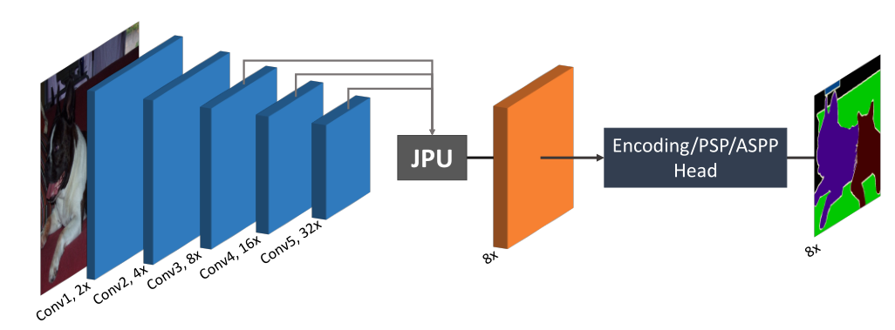

# FastFCN_paddle

## 1 简介
  
本项目基于paddlepaddle框架复现了FastFCN语义分割模型，使用的backbone是ENCNet_resnet50，FastFCN利用JPU模块来提升语义分割的效果。

**论文：**
- [1] Huikai Wu, Junge Zhang, Kaiqi Huang. [FastFCN: Rethinking Dilated Convolution in the Backbone for Semantic Segmentation](https://paperswithcode.com/paper/fastfcn-rethinking-dilated-convolution-in-the)

**项目参考：**
- [https://github.com/wuhuikai/FastFCN](https://github.com/wuhuikai/FastFCN)

## 2 复现精度
>ADE20K val数据集的测试效果如下表。


|NetWork |steps|opt|image_size|batch_size|dataset|memory|card|mIou|config|weight|log|
| :---: | :---: | :---: | :---: | :---: | :---: | :---: | :---: | :---: | :---: | :---: | :---: |
|FastFCN|120K(只训练了不到90k)|SGD|1024x512|4|ADE20K|32G|4|42.8|[fastfcn_ade20k_520x520_120k.yml](configs/fastfcn_ade20k_520x520_120k.yml)|[weight](https://bj.bcebos.com/v1/ai-studio-cluster-infinite-task/outputs/105110.tar?authorization=bce-auth-v1%2F0ef6765c1e494918bc0d4c3ca3e5c6d1%2F2021-11-25T08%3A56%3A00Z%2F-1%2F%2F27d2bd5ec48e4e1a4463f7af2765071742a8ce9791fb3d4c0ddd013de854fa07) |[log](log/trainer-0.log)|

## 3 数据集
[ADE20K dataset](http://groups.csail.mit.edu/vision/datasets/ADE20K/)

- 数据集大小:
    - 训练集: 20210
    - 验证集: 200
    - 类别: 150

## 4 环境依赖
- 硬件: Tesla V100 * 4

- 框架:
    - PaddlePaddle == 2.2.0
  
    
## 快速开始

### 第一步：克隆本项目
```bash
# clone this repo
git clone https://github.com/justld/FastFCN_paddle.git
cd FastFCN_paddle
```

**安装第三方库**
```bash
pip install -r requirements.txt
```


### 第二步：训练模型
单卡训练：
```bash
python train.py --config configs/fastfcn_ade20k_520x520_120k.yml  --do_eval --use_vdl --log_iter 100 --save_interval 1000 --save_dir output
```
多卡训练：
```bash
python -m paddle.distributed.launch train.py --config configs/fastfcn_ade20k_520x520_120k.yml  --do_eval --use_vdl --log_iter 100 --save_interval 1000 --save_dir output
```

### 第三步：测试
```bash
python val.py --config configs/fastfcn_ade20k_520x520_120k.yml --model_path {your model path}
```

### 第四步：test_tipc
output目录下包含已经训练好的模型参数以及对应的日志文件。
```bash
bash test_tipc/prepare.sh ./test_tipc/configs/fastfcn_small/train_infer_python.txt 'lite_train_infer'
bash test_tipc/test_train_inference_python.sh ./test_tipc/fastfcn_small/encnet_small/train_infer_python.txt 'lite_train_infer'
```

## 5 代码结构与说明
**代码结构**
```
├─configs           
├─deploy  
├─log                 
├─images                         
├─output                           
├─paddleseg                                                   
│  export.py                     
│  predict.py                        
│  README.md                        
│  README_CN.md                     
│  requirements.txt                      
│  setup.py                   
│  train.py                
│  val.py                       
```
**说明**
1、本项目在Aistudio平台，使用Tesla V100 * 4 脚本任务训练120K 42.8%。  
2、本项目基于PaddleSeg开发。  

## 6 模型信息

相关信息:

| 信息 | 描述 |
| --- | --- |
| 作者 | 郎督|
| 日期 | 2021年11月 |
| 框架版本 | PaddlePaddle==2.2.0 |
| 应用场景 | 语义分割 |
| 硬件支持 | GPU、CPU |
| 在线体验 | [notebook], [Script](https://aistudio.baidu.com/aistudio/clusterprojectdetail/3031961)|


